# Pet-Mk-VIII
<h1 align="center">Welcome to the Pet-Mk-VIII repository</h1>
<h1 align="center">The Robot Dashboard</h1>

# Pet series micro robots #
<table>
    <tr>
        <td></td>
        <td>The main objective/scope for this repository is to manage the part of the software (and parameter settings) 
            that is unique for this Pet Mark VIII (eight) robot. A.k.a "The Dashboard".<br>
            <br>
            ROS repository in the https://github.com/Pet-Series Git-Organizations.<br>
            Containing multiply ROS1/ROS2-packages.
        </td>
    </tr>
</table>

# This dashboard should be able to... #
1. Manually operate the various robots (using the joystick).<br>...or any other ROS1/ROS2 bot controlled via topic cmd_vel (command velocity).
1. Launch ROS2 missions (using built in 7" touch display, keyboard and mouse)
2. Patch/tune parameters via trim-potentiometers (as various PID-systems)
3. Monitor in real time robot data (using RViz and RQT).
4. Generic GPIO-connected LED's (most for fun🤪).
5. Generic GPIO-connected buttons (trig, launch ROS2-tasks...) 
6. Last minute debugging/patching😇 using the dashboard as developing terminal (using ssh, xRDP or VisualCode)

# The journey is the goal
The goul with our work is "It should be fun" and "The journey is the goal".
<table>
    <tr>History: Pet-Mk.VIII early iterations
      <td>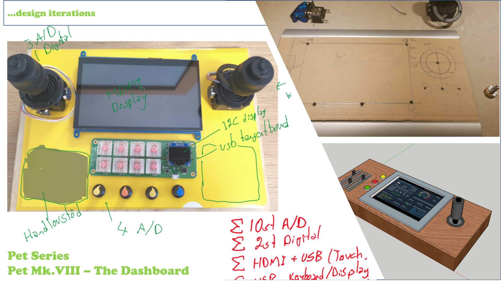</td>
      <td>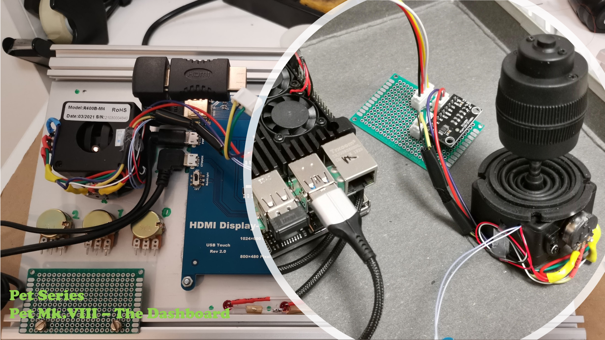</td>
    </tr>
</table>

<table>
    <tr>History: The dashboard just starting to take shape.
      <td>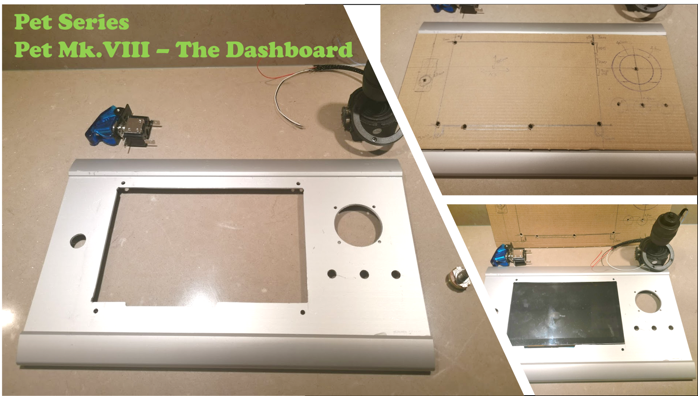</td>
      <td>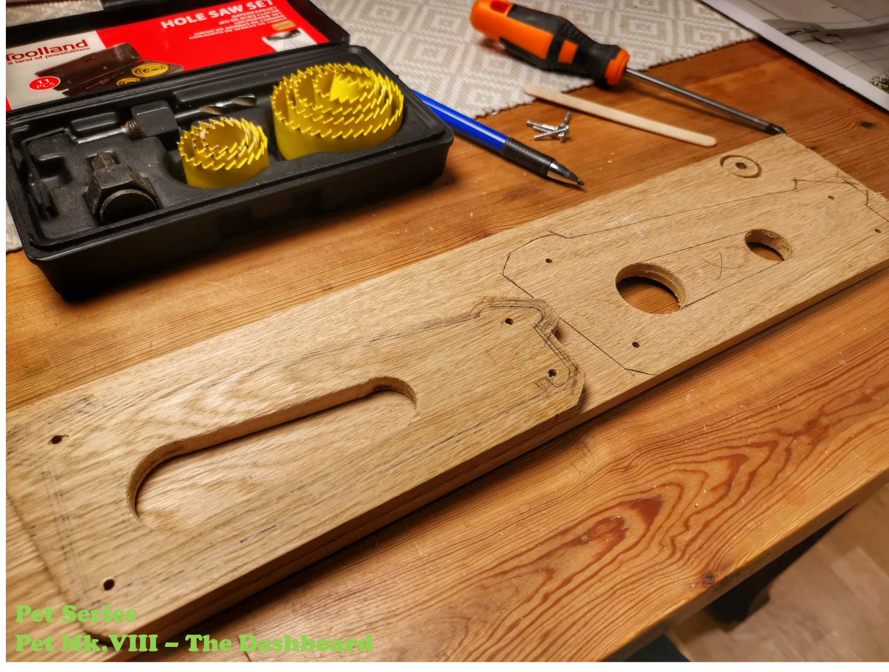</td>
    </tr>
</table>

<table>
    <tr>History: Electrical installation is beginning to take place
      <td></td>
      <td>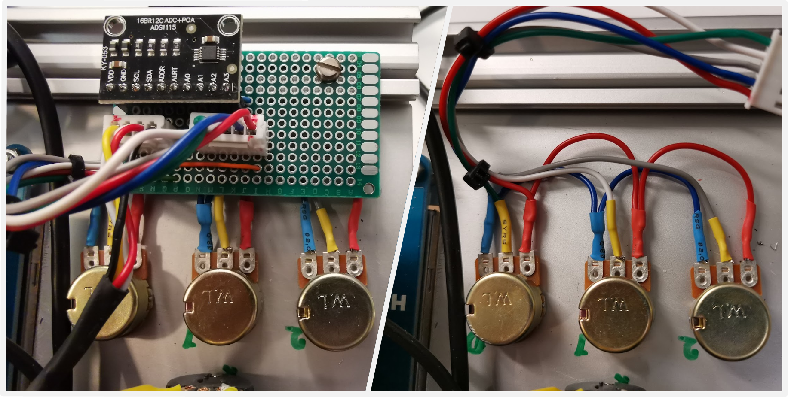</td>
    </tr>
</table>

<table>
    <tr>Mechanical & Electrical Done
      <td>Exterior Done<br>
      </td>
    </tr>
    <tr>
      <td>Interior Done<br>
      </td>
    </tr>
</table>

# ROS2 System
* Raspberry Pi 4 (8GB)
    * built in 7" touch display
    * wireless keyboard and mouse
    * WiFi to communicate with robots
* Ubuntu(64-bit) is used as operating system.
* ROS2 (Robot Operating System 2) is used as middleware.
* Docker to run ROS2

## ROS2 Module: Joystick
Using Analog/Digital Converter ADS1115 via I2C (3 of 4 channels in use)<br>
- 3 directions joystick with each a 10K potentiometer.

For more information see repo https://github.com/Pet-Series/pet_ros2_joystick_pkg
<table>
    <tr>
      <td>Wiring diagram<br>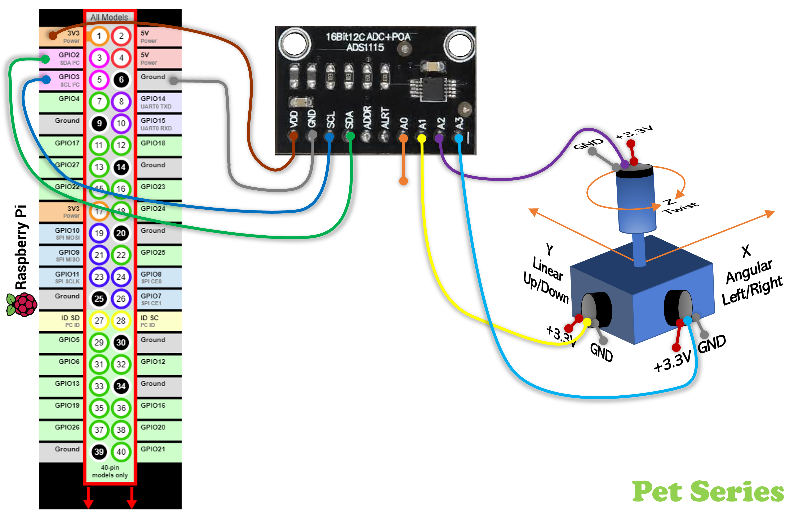</td>
      <td>Node graph<br>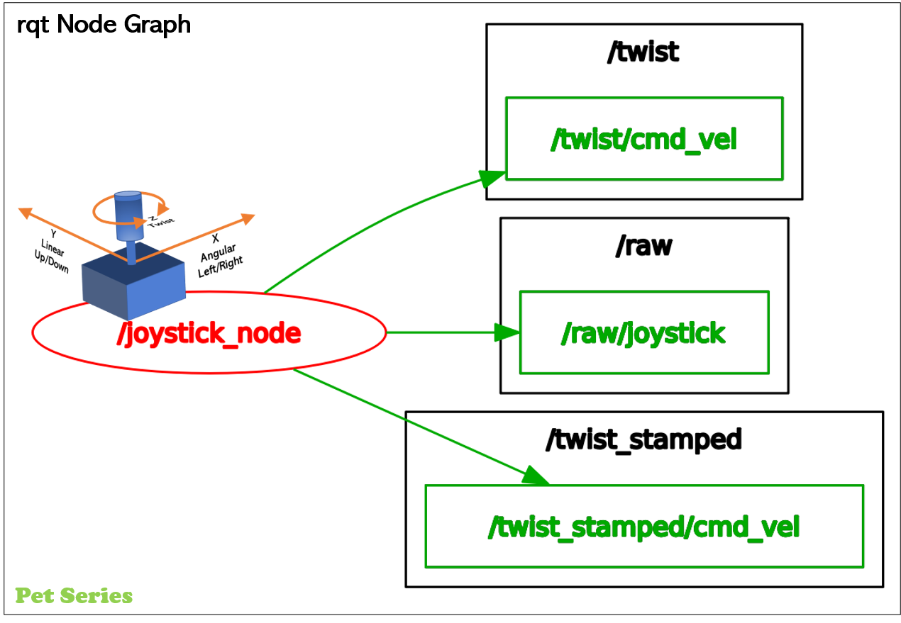</td>
    </tr>
</table>

## ROS2 Module: Trim Potentiometers
Using Analog/Digital Converter ADS1115 via I2C (3 of 4 channels in use)<br>
- 3x 10K Potentiometers
For more information see pkg https://github.com/Pet-Series/Pet-Mk-VIII/tree/main/pet_mk_viii
<table>
    <tr>
      <td>Wiring diagram<br>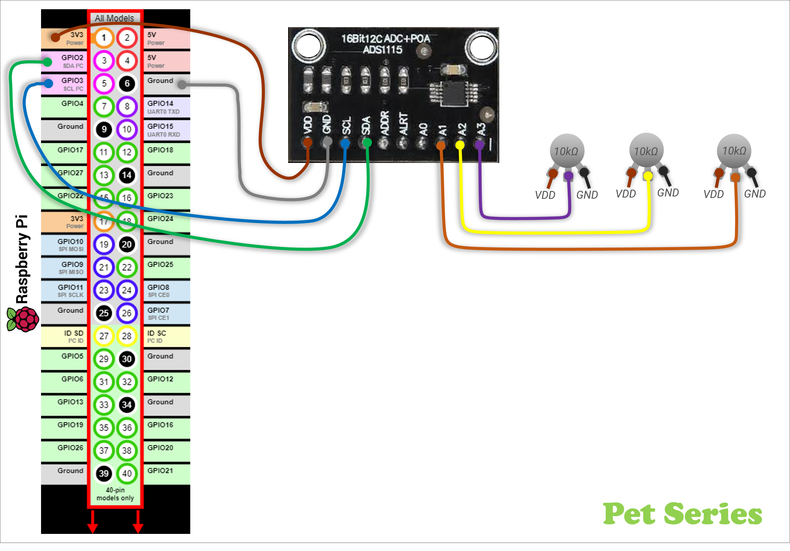</td>
      <td>Node graph<br>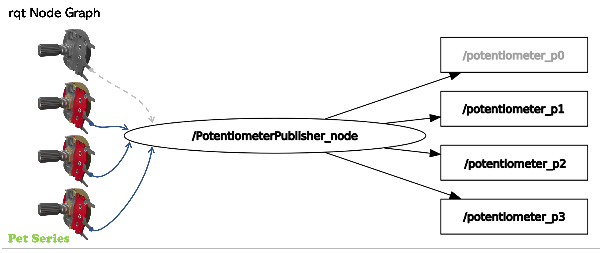</td>
    </tr>
</table>

## ROS2 Module: Buttons
Using direct GPIO-pins.
- 1x button/switch as "main switch"
- 1x button/switch on top of joystick

For more information see pkg https://github.com/Pet-Series/Pet-Mk-VIII/tree/main/pet_mk_viii
<table>
    <tr>
      <td>Wiring diagram<br>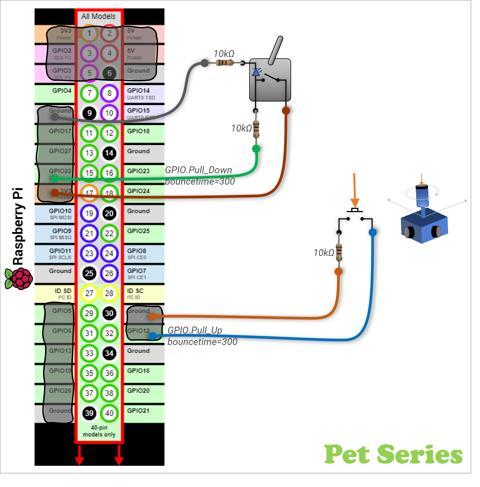</td>
      <td>Node graph<br>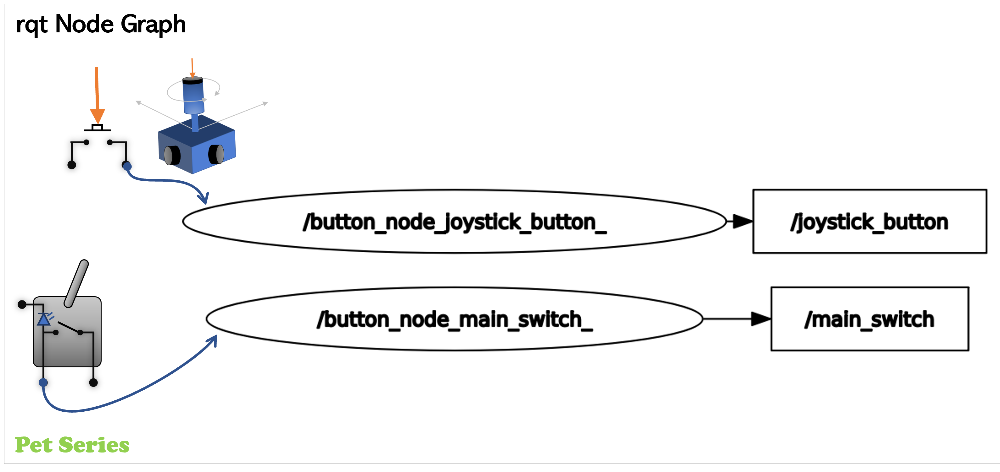</td>
    </tr>
</table>

## ROS2 Module: LED-strip
Using direct GPIO-pins<br>
- 5x LED with in series with a 1K resistor
For more information see pkg https://github.com/Pet-Series/Pet-Mk-VIII/tree/main/pet_mk_viii
<table>
    <tr>
      <td>Wiring diagram<br>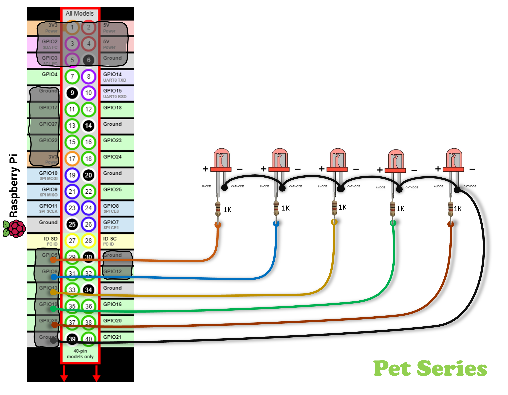</td>
      <td></td>
    </tr>
</table>

## ROS2 Module: Current & Voltage monitoring
Using INA219 sensor via I2C-bus to measure internal voltage & current status for the Dashboard.<br>
For more information see repo https://github.com/Pet-Series/pet_ros2_currentsensor_ina219_pkg
<table>
    <tr>
      <td>Wiring diagram<br>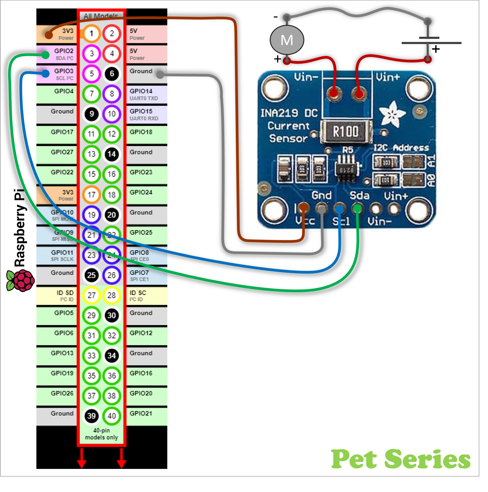</td>
      <td></td>
    </tr>
</table>

# Setup
⚠️This documentation section is under construction
## Setup Ubuntu 22.04 LTS
`Do some boring installation stuff...`
## Setup Docker
`Install & setup docker stuff...`
## Setup git repositories
`Ubuntu Shell - Clone repositories`
```bash
~$ mkdir -p ~/ws_ros2/src
~$ cd ~/ws_ros2/src
~/ws_ros2/src$ git clone https://github.com/Pet-Series/Pet-Mk-VIII
   ...
~/ws_ros2/src$ git clone https://github.com/Pet-Series/pet_ros2_joystick_pkg.git
   ...
~/ws_ros2/src$ git clone https://github.com/Pet-Series/pet_ros2_currentsensor_ina219_pkg.git
   ...
~/ws_ros2/src$
```

## Setup ROS2 workspace
I don't have ROS2 installed directly on my host. I chose not to install ROS2 directly on the host/SCB/RPi, but to run ROS2 via Docker - Therfore must this step be done from within an interactive ROS2-Docker container.<br>
`Ubuntu Shell - Build/Initiate ROS2 Work Space`
```bash
~/ws_ros2/src$ cd ..
~/ws_ros2$ 
~/ws_ros2$ colcon build --symlink-install
~/ws_ros2$ source /opt/ros/humble/setup.bash
~/ws_ros2$ source ./install/setup.bash
```

## Launch ROS2 nodes
Launch individual nodes one by one...
```bash
~/ws_ros2$ ros2 run pet_mk_viii_joystick joystick_node
~/ws_ros2$ ros2 run pet_mk_viii pet_buttons_node.py
~/ws_ros2$ ros2 launch pet_mk_viii panel_led_0..4_subscribers.launch.py
~/ws_ros2$ ros2 run pet_ros2_battery_state_pkg pet_battery_state_ina219_node
```
Or by one launch file...
```bash
~/ws_ros2$ ros2 launch pet_mk_viii pet-mk-viii-bringup.launch.py
   ...
~/ws_ros2/src$

```
# External references
- http://wiki.ros.org/
