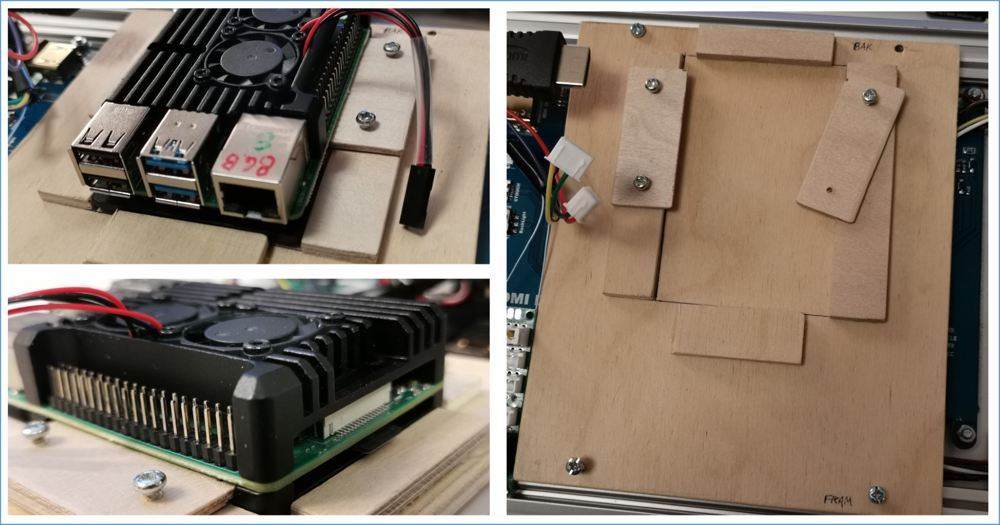

# Pet-Mk-VIII
<h1 align="center">Welcome to the Pet-Mk-VIII repository</h1>
<h1 align="center">The Robot Dashboard</h1>

ROS repository in the https://github.com/Pet-Series Git-Organizations.</br>
Containing multiply ROS1/ROS2-packages.

# Software/Setup Pet series micro robots #
The main objective/scope for this repository is to control the part of the software (and parameter settings) that is unique for this Pet Mark VIII (eight) robot. A.k.a "The Dashboard".

ROS2 (Robot Operating System v2) is used as middleware.
Ubuntu is used as operating system.

# The journey is the goal
<table>
    <tr>Pet-Mk.VIII early iterations
      <td></td>
      <td></td>
    </tr>
</table>
<table>
    <tr>The dashboard just starting to take shape.
      <td></td>
      <td></td>
    </tr>
</table>
<table>
    <tr>Electrical installation is beginning to take place
      <td></td>
      <td></td>
    </tr>
</table>

# Modules
## Module: Joystick
Using Analog/Digital Converter ADS1115 via I2C (3 of 4 channels in use)<br>
- 3 directions joystick with each a 10K potentiometer.

For more information see https://github.com/Pet-Series/pet_ros2_joystick_pkg
<table>
    <tr>
      <td>Wiring diagram<br></td>
      <td>Node graph<br></td>
    </tr>
</table>

## Module: Trim Potentiometers
Using Analog/Digital Converter ADS1115 via I2C (3 of 4 channels in use)<br>
- 3x 10K Potentiometers
For more information see pkg https://github.com/Pet-Series/Pet-Mk-VIII/tree/main/pet_mk_viii
<table>
    <tr>
      <td>Wiring diagram<br></td>
      <td>Node graph<br></td>
    </tr>
</table>

## Module: Buttons
Using direct GPIO-pins.
- 1x button/switch as "main switch"
- 1x button/switch on top of joystick

For more information see pkg https://github.com/Pet-Series/Pet-Mk-VIII/tree/main/pet_mk_viii
<table>
    <tr>
      <td>Wiring diagram<br></td>
      <td>Node graph<br></td>
    </tr>
</table>

## Module: LED-strip
Using direct GPIO-pins<br>
- 5x LED with in series with a 1K resistor
For more information see pkg https://github.com/Pet-Series/Pet-Mk-VIII/tree/main/pet_mk_viii
<table>
    <tr>
      <td>Wiring diagram<br></td>
      <td></td>
    </tr>
</table>

## Module: Current & Voltage monitoring
Using INA219 sensor via I2C-bus to measure internal voltage & current status for the Dashboard.
<table>
    <tr>
      <td>Wiring diagram<br></td>
      <td></td>
    </tr>
</table>

# Setup
⚠️This documentation section is under construction
## Setup Ubuntu 22.04 LTS
`Do some boring installation stuff...`
## Setup Docker
`Install & setup docker stuff...`
## Setup git repositories
`Ubuntu Shell - Clone repositories`
```
~$ mkdir -p ~/ws_ros2/src
~$ cd ~/ws_ros2/src
~/ws_ros2/src$ git clone https://github.com/Pet-Series/Pet-Mk-VIII
   ...
~/ws_ros2/src$ git clone https://github.com/Pet-Series/pet_ros2_joystick_pkg.git
   ...
~/ws_ros2/src$ git clone https://github.com/Pet-Series/pet_ros2_currentsensor_ina219_pkg.git
   ...
~/ws_ros2/src$
```

## Setup ROS2 workspace
I don't have ROS2 installed directly on my host. I chose not to install ROS2 directly on the host/SCB/RPi, but to run ROS2 via Docker - Therfore must this step be done from within an interactive ROS2-Docker container.<br>
`Ubuntu Shell - Build/Initiate ROS2 Work Space`
```
~/ws_ros2/src$ cd ..
~/ws_ros2$ 
~/ws_ros2$ colcon build --symlink-install
~/ws_ros2$ source /opt/ros/humble/setup.bash
~/ws_ros2$ source ./install/setup.bash
```

## Launch ROS2 nodes
Launch individual nodes one by one...
```
~/ws_ros2$ ros2 run pet_mk_viii_joystick joystick_node
~/ws_ros2$ ros2 run pet_mk_viii pet_buttons_node.py
~/ws_ros2$ ros2 launch pet_mk_viii panel_led_0..4_subscribers.launch.py
~/ws_ros2$ ros2 run pet_ros2_battery_state_pkg pet_battery_state_ina219_node
```
Or by one launch file...
```
~/ws_ros2$ ros2 launch pet_mk_viii pet-mk-viii-bringup.launch.py
   ...
~/ws_ros2/src$

```
# External references
- http://wiki.ros.org/
